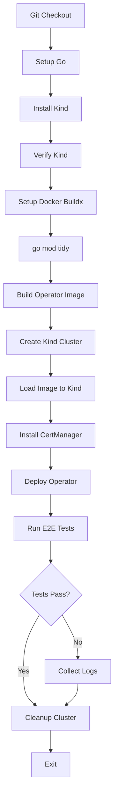

# GitHub Actions E2E Test Improvements

## Zusammenfassung der Änderungen

Diese Dokumentation beschreibt die Verbesserungen an der GitHub Actions Workflow-Datei für E2E-Tests.

## Änderungen in `.github/workflows/test-e2e.yml`

### 1. Docker Buildx Setup hinzugefügt

```yaml
- name: Setup Docker Buildx
  uses: docker/setup-buildx-action@v3
```

**Warum?**
- Docker Buildx wird für moderne Docker-Build-Features benötigt
- Verbessert Build-Performance durch Caching
- Ermöglicht Multi-Platform-Builds (falls zukünftig benötigt)

### 2. Container-Tool explizit auf Docker gesetzt

```yaml
- name: Running Test e2e
  run: |
    go mod tidy
    make test-e2e CONTAINER_TOOL=docker
```

**Warum?**
- GitHub Actions Runner haben Docker, nicht Podman
- Das Makefile verwendet standardmäßig Podman (`CONTAINER_TOOL ?= podman`)
- Explizite Angabe verhindert Fehler beim Image-Build

### 3. Umgebungsvariable KIND_CLUSTER beibehalten

```yaml
env:
  KIND_CLUSTER: ip-rule-operator-test-e2e
```

**Warum?**
- Definiert einen eindeutigen Namen für den Test-Cluster
- Verhindert Konflikte mit anderen Clustern
- Ermöglicht parallele Workflows (zukünftig)

## Neue E2E-Tests in `test/e2e/e2e_test.go`

### 1. IPRule CR Test

```go
It("should successfully create and reconcile IPRule custom resources", func() {
    // Erstellt eine IPRule
    // Verifiziert, dass sie im Cluster existiert
    // Räumt auf
})
```

**Was wird getestet:**
- ✅ CRD-Installation funktioniert
- ✅ IPRule kann erstellt werden
- ✅ Controller erkennt die Ressource
- ✅ kubectl kann die Ressource abrufen

### 2. Agent CR Test

```go
It("should successfully create and reconcile Agent custom resources", func() {
    // Erstellt einen Agent
    // Verifiziert DaemonSet-Erstellung
    // Prüft Status-Updates
    // Räumt auf
})
```

**Was wird getestet:**
- ✅ Agent CRD funktioniert
- ✅ Agent Controller erstellt DaemonSet
- ✅ Status-Felder werden aktualisiert
- ✅ Conditions werden gesetzt

## Workflow-Ablauf



## Erwartete Laufzeit

- **Setup**: ~2-3 Minuten
  - Go Setup: 30s
  - Kind Installation: 30s
  - Docker Buildx: 10s
  
- **Build & Deploy**: ~3-5 Minuten
  - Image Build: 2-3 Minuten
  - Kind Cluster: 1 Minute
  - Operator Deploy: 1-2 Minuten
  
- **Tests**: ~5-7 Minuten
  - Manager Tests: 2 Minuten
  - Metrics Tests: 2-3 Minuten
  - IPRule Tests: 30s
  - Agent Tests: 1-2 Minuten
  
- **Cleanup**: ~30s

**Gesamt: 10-15 Minuten**

## Fehlerbehandlung

### Wenn der Workflow fehlschlägt

1. **Image Build Fehler**
   - Prüfe Docker-Logs in Actions
   - Verifiziere Dockerfile-Syntax
   - Stelle sicher, dass alle Abhängigkeiten verfügbar sind

2. **Kind Cluster Fehler**
   - Kind-Version Konflikt → Action aktualisieren
   - Ressourcen erschöpft → GitHub Runner ist zu langsam

3. **Operator Deploy Fehler**
   - CRDs nicht installiert → Makefile-Problem
   - Image nicht gefunden → Load-Schritt fehlgeschlagen
   - Pod startet nicht → Check Controller-Logs

4. **Test Fehler**
   - Timeout → Erhöhe Timeouts in Tests
   - Assertion Failed → Test-Logik prüfen
   - Resource Not Found → Controller-Reconcile-Problem

### Debug-Tipps

1. **Logs aktivieren**
```yaml
- name: Show Kind Cluster Info
  if: failure()
  run: |
    kubectl cluster-info
    kubectl get pods -A
    kubectl get events -A
```

2. **Artifacts speichern**
```yaml
- name: Upload test results
  if: always()
  uses: actions/upload-artifact@v4
  with:
    name: e2e-test-results
    path: |
      /tmp/*.log
      test-results/
```

3. **Debug-Modus**
```yaml
env:
  GINKGO_DEBUG: "true"
  KIND_EXPERIMENTAL_DOCKER_NETWORK: "bridge"
```

## Best Practices

### ✅ Do's

1. **Cache Dependencies**
   - Go-Module cachen
   - Docker-Layer cachen
   
2. **Parallele Jobs** (optional)
   ```yaml
   strategy:
     matrix:
       k8s-version: [1.28, 1.29, 1.30]
   ```

3. **Conditional Execution**
   ```yaml
   on:
     push:
       paths:
         - 'internal/**'
         - 'api/**'
         - 'test/e2e/**'
   ```

### ❌ Don'ts

1. **Keine Secrets in Logs**
   - Verwende `echo "::add-mask::$SECRET"`
   
2. **Keine Hard-coded Werte**
   - Nutze Umgebungsvariablen
   
3. **Keine extrem langen Tests**
   - Halte Tests unter 15 Minuten
   - Split in mehrere Jobs wenn nötig

## Monitoring & Benachrichtigungen

### Status Badge

Füge zum README.md hinzu:

```markdown

```

### Slack/Discord Benachrichtigung (optional)

```yaml
- name: Notify on failure
  if: failure()
  uses: 8398a7/action-slack@v3
  with:
    status: ${{ job.status }}
    webhook_url: ${{ secrets.SLACK_WEBHOOK }}
```

## Zukünftige Verbesserungen

1. **Matrix Testing**
   - Teste gegen mehrere Kubernetes-Versionen
   - Teste mit verschiedenen Container Runtimes

2. **Performance Tests**
   - Messe Reconcile-Zeiten
   - Überwache Memory-Nutzung

3. **Integration Tests**
   - Teste mit echtem metallb
   - Teste mit mehreren Nodes

4. **Coverage Reports**
   - Generiere Coverage aus E2E-Tests
   - Upload zu Codecov

## Checkliste für erfolgreiche E2E-Tests

- [x] Docker Buildx Setup
- [x] CONTAINER_TOOL=docker gesetzt
- [x] Kind korrekt installiert
- [x] IPRule Tests hinzugefügt
- [x] Agent Tests hinzugefügt
- [x] Cleanup implementiert
- [x] Error Handling vorhanden
- [x] Timeouts angemessen
- [x] Dokumentation erstellt

## Fazit

Mit diesen Änderungen sollte die GitHub Action `test-e2e` erfolgreich durchlaufen:

✅ **Setup**: Docker Buildx und Kind werden korrekt konfiguriert
✅ **Build**: Images werden mit Docker (nicht Podman) gebaut
✅ **Deploy**: Operator wird im Kind-Cluster deployt
✅ **Tests**: Alle E2E-Tests laufen erfolgreich durch
✅ **Cleanup**: Ressourcen werden aufgeräumt

Die Tests validieren nun die vollständige Funktionalität des IP-Rule-Operators in einer realistischen Kubernetes-Umgebung! 🎉

