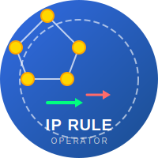

<div align="center">
  
  
  # IP Rule Operator

  [](https://opensource.org/licenses/Apache-2.0)
  [](https://goreportcard.com/report/github.com/mariusbertram/ip-rule-operator)
  [](https://kubernetes.io)
  [](https://www.openshift.com)

  **Automatische Verwaltung von IP-Routing-Regeln auf Kubernetes-Nodes**
  
  *Policy-Based Routing für Kubernetes LoadBalancer Services*

</div>

---

Ein Kubernetes-Operator zur automatischen Verwaltung von IP-Routing-Regeln auf Cluster-Nodes basierend auf Service LoadBalancer-IPs.

## 📋 Überblick

Der **IP Rule Operator** ermöglicht Policy-Based Routing in Kubernetes-Clustern durch automatische Konfiguration von Linux IP-Regeln auf Cluster-Nodes. Der Operator überwacht LoadBalancer-Services und erstellt basierend auf definierten Policies IP-Routing-Regeln, die Traffic von Service ClusterIPs über spezifische Routing-Tabellen leiten.

### Was macht der Operator?

Der Operator besteht aus zwei Hauptkomponenten:

1. **Controller (Manager)**: 
   - Überwacht Kubernetes LoadBalancer-Services
   - Matched LoadBalancer-IPs gegen definierte IPRule-Policies (CIDR-basiert)
   - Generiert automatisch IPRuleConfig-Ressourcen für jeden Service
   - Verwaltet den Agent-DaemonSet

2. **Agent (DaemonSet)**:
   - Läuft auf jedem Node mit hostNetwork-Zugriff
   - Wendet IP-Routing-Regeln auf dem Node an/entfernt sie
   - Nutzt Linux netlink für direkte Kernel-Interaktion
   - Reconciled kontinuierlich den gewünschten Zustand

### Was ist Policy-Based Routing?

**Policy-Based Routing (PBR)** ermöglicht es, Routing-Entscheidungen nicht nur basierend auf der Ziel-IP-Adresse zu treffen (wie beim klassischen Routing), sondern auch basierend auf anderen Kriterien wie der **Quell-IP-Adresse**.

#### Anwendungsfall im Kubernetes-Kontext:

In einem Kubernetes-Cluster mit mehreren Netzwerk-Interfaces oder Load-Balancern möchten Sie möglicherweise:

- **Multi-Homing**: Traffic von bestimmten Services über ein spezifisches Netzwerk-Interface leiten
- **Provider-basiertes Routing**: Services verschiedener Mandanten über unterschiedliche ISP-Uplinks routen
- **Traffic-Segregation**: Produktions- und Test-Traffic physisch trennen
- **Geo-Routing**: Traffic basierend auf LoadBalancer-IP-Bereichen regional verteilen

#### Wie funktioniert es?

Der Operator nutzt Linux **IP Rules** (siehe `ip rule`), um Traffic basierend auf der Quell-IP (Service ClusterIP) über alternative Routing-Tabellen zu leiten:

```bash
# Beispiel: Traffic von Service 10.96.1.50 nutzt Routing-Tabelle 100
ip rule add from 10.96.1.50 lookup 100 priority 1000
```

Die Routing-Tabelle 100 kann dann eigene Routes enthalten, z.B.:
```bash
# Tabelle 100: Traffic über spezielles Gateway
ip route add default via 192.168.1.1 dev eth1 table 100
```

**Resultat**: Alle Pakete, die von der Service-IP `10.96.1.50` stammen, werden über das Gateway `192.168.1.1` geroutet, während andere Services die Standard-Route nutzen.

## 🏗️ Architektur

### Komponenten-Diagramm

```
┌─────────────────────────────────────────────────────────────────┐
│                        Kubernetes Cluster                        │
│                                                                   │
│  ┌────────────────────────────────────────────────────────────┐ │
│  │                     Control Plane                           │ │
│  │                                                              │ │
│  │  ┌──────────────────────────────────────────────────────┐  │ │
│  │  │         IP Rule Operator (Controller)                │  │ │
│  │  │                                                       │  │ │
│  │  │  1. Watches Services (LoadBalancer)                  │  │ │
│  │  │  2. Matches LB-IPs against IPRule CRDs              │  │ │
│  │  │  3. Generates IPRuleConfig CRDs                      │  │ │
│  │  │  4. Manages Agent DaemonSet                          │  │ │
│  │  └──────────────────────────────────────────────────────┘  │ │
│  │                            │                                 │ │
│  │                            │ watches                         │ │
│  │                            ▼                                 │ │
│  │  ┌──────────────────────────────────────────────────────┐  │ │
│  │  │              Custom Resources (CRDs)                  │  │ │
│  │  │                                                       │  │ │
│  │  │  ┌─────────────┐  ┌──────────────┐  ┌────────────┐ │  │ │
│  │  │  │   IPRule    │  │ IPRuleConfig │  │   Agent    │ │  │ │
│  │  │  │ (User-def.) │  │ (Generated)  │  │ (Deploy)   │ │  │ │
│  │  │  │             │  │              │  │            │ │  │ │
│  │  │  │ cidr: ...   │  │ serviceIP    │  │ image: ... │ │  │ │
│  │  │  │ table: 100  │  │ table: 100   │  │ nodeSelect.│ │  │ │
│  │  │  │ priority    │  │ state: ...   │  │            │ │  │ │
│  │  │  └─────────────┘  └──────────────┘  └────────────┘ │  │ │
│  │  └──────────────────────────────────────────────────────┘  │ │
│  └────────────────────────────────────────────────────────────┘ │
│                                                                   │
│  ┌────────────────────────────────────────────────────────────┐ │
│  │                        Worker Nodes                         │ │
│  │                                                              │ │
│  │  Node 1                Node 2                Node 3          │ │
│  │  ┌──────────┐         ┌──────────┐         ┌──────────┐    │ │
│  │  │  Agent   │         │  Agent   │         │  Agent   │    │ │
│  │  │  Pod     │         │  Pod     │         │  Pod     │    │ │
│  │  │ (DaemonS)│         │ (DaemonS)│         │ (DaemonS)│    │ │
│  │  │          │         │          │         │          │    │ │
│  │  │  Reads   │         │  Reads   │         │  Reads   │    │ │
│  │  │  IPRule  │         │  IPRule  │         │  IPRule  │    │ │
│  │  │  Config  │         │  Config  │         │  Config  │    │ │
│  │  │    ↓     │         │    ↓     │         │    ↓     │    │ │
│  │  │ Applies  │         │ Applies  │         │ Applies  │    │ │
│  │  │ ip rules │         │ ip rules │         │ ip rules │    │ │
│  │  │ via      │         │ via      │         │ via      │    │ │
│  │  │ netlink  │         │ netlink  │         │ netlink  │    │ │
│  │  └────┬─────┘         └────┬─────┘         └────┬─────┘    │ │
│  │       │                    │                    │           │ │
│  │       ▼                    ▼                    ▼           │ │
│  │  ┌─────────────────────────────────────────────────────┐   │ │
│  │  │          Linux Kernel Routing Tables                │   │ │
│  │  │                                                      │   │ │
│  │  │  ip rule show:                                      │   │ │
│  │  │    1000: from 10.96.1.50 lookup 100                │   │ │
│  │  │    1000: from 10.96.1.51 lookup 200                │   │ │
│  │  │    ...                                               │   │ │
│  │  └─────────────────────────────────────────────────────┘   │ │
│  └────────────────────────────────────────────────────────────┘ │
└───────────────────────────────────────────────────────────────────┘
```

### Ressourcen-Interaktion

```
┌──────────────────────────────────────────────────────────────────┐
│                    Workflow & Interaktionen                       │
└──────────────────────────────────────────────────────────────────┘

  User/Admin                     Kubernetes API
      │                                │
      │ 1. Create IPRule               │
      ├───────────────────────────────>│
      │    (cidr: 192.168.1.0/24)      │
      │    (table: 100, priority: 1000)│
      │                                │
      │ 2. Create Service (LB)         │
      ├───────────────────────────────>│
      │    (LoadBalancer)              │
      │                                │
                                       │
                      ┌────────────────┴────────────────┐
                      │                                  │
                      ▼                                  │
           IP Rule Controller                            │
                      │                                  │
        3. Watches Services & IPRules                    │
                      │                                  │
        4. Service gets LB IP: 192.168.1.10              │
           ClusterIP: 10.96.1.50                         │
                      │                                  │
        5. Matches: 192.168.1.10 ∈ 192.168.1.0/24       │
                      │                                  │
        6. Creates IPRuleConfig ────────────────────────>│
           - name: iprc-10-96-1-50                       │
           - serviceIP: 10.96.1.50                       │
           - table: 100                                  │
           - priority: 1000                              │
           - state: present                              │
                                                         │
                      ┌──────────────────────────────────┘
                      │
                      ▼
              Agent Controller
                      │
        7. Ensures Agent DaemonSet exists
                      │
                      ├───> Creates/Updates DaemonSet
                      │
                      ▼
            Agent Pods (on each node)
                      │
        8. Reconcile Loop (every 10s):
           - List all IPRuleConfig
           - Read current ip rules (netlink)
                      │
        9. For state=present:
           ├─> Check if rule exists
           └─> If not: ip rule add from 10.96.1.50 
                          lookup 100 priority 1000
                      │
       10. For state=absent:
           ├─> Check if rule exists
           └─> If yes: ip rule del from 10.96.1.50
                          lookup 100 priority 1000
                      │
                      ▼
           ┌──────────────────────┐
           │  Linux Kernel        │
           │  Routing Applied     │
           └──────────────────────┘

────────────────────────────────────────────────────────────────────
  Cleanup Workflow (Service deleted)
────────────────────────────────────────────────────────────────────

    Service Deleted
          │
          ▼
    IP Rule Controller
          │
    11. LoadBalancer IP no longer exists
          │
    12. Updates IPRuleConfig:
        - state: present → absent
          │
          ▼
    Agent Pods
          │
    13. Detects state=absent
          │
    14. Removes ip rule from node
        (ip rule del from 10.96.1.50 ...)
          │
          ▼
    Cleanup Complete
```

## 🚀 Installation

### Voraussetzungen

- Kubernetes v1.11.3+ oder OpenShift 4.x+
- kubectl oder oc CLI konfiguriert
- Cluster-Admin-Rechte für Installation
- Linux-Nodes (Agent benötigt Linux-Kernel mit netlink-Support)

### Methode 1: Installation via YAML (Kubernetes)

#### Schritt 1: CRDs installieren

```bash
kubectl apply -f https://raw.githubusercontent.com/mariusbertram/ip-rule-operator/main/config/crd/bases/api.operator.brtrm.dev_iprules.yaml
kubectl apply -f https://raw.githubusercontent.com/mariusbertram/ip-rule-operator/main/config/crd/bases/api.operator.brtrm.dev_ipruleconfigs.yaml
kubectl apply -f https://raw.githubusercontent.com/mariusbertram/ip-rule-operator/main/config/crd/bases/api.operator.brtrm.dev_agents.yaml
```

Oder mit Makefile (aus Repository):
```bash
make install
```

#### Schritt 2: Operator deployen

Mit vorgebauten Images:
```bash
kubectl apply -f https://raw.githubusercontent.com/mariusbertram/ip-rule-operator/main/dist/install.yaml
```

Oder selbst bauen und deployen:
```bash
export IMG=ghcr.io/mariusbertram/iprule-controller:v0.0.1
export AGENT_IMG=ghcr.io/mariusbertram/iprule-agent:v0.0.1

# Images bauen und pushen
make docker-build-all docker-push-all

# Operator deployen
make deploy IMG=${IMG}
```

#### Schritt 3: Agent-DaemonSet erstellen

```bash
cat <<EOF | kubectl apply -f -
apiVersion: api.operator.brtrm.dev/v1alpha1
kind: Agent
metadata:
  name: iprule-agent
  namespace: ip-rule-operator-system
spec:
  # Optional: Spezifisches Image
  # image: ghcr.io/mariusbertram/iprule-agent:v0.0.1
  
  # Optional: Node-Selektor
  nodeSelector:
    kubernetes.io/os: linux
  
  # Optional: Tolerations für Control-Plane-Nodes
  tolerations:
  - key: node-role.kubernetes.io/control-plane
    operator: Exists
    effect: NoSchedule
EOF
```

#### Schritt 4: Verifizierung

```bash
# Prüfe Operator-Pod
kubectl get pods -n ip-rule-operator-system

# Prüfe Agent-DaemonSet
kubectl get daemonset -n ip-rule-operator-system iprule-agent

# Prüfe CRDs
kubectl get crds | grep api.operator.brtrm.dev
```

### Methode 2: Installation via OLM (OpenShift)

Der Operator kann über den Operator Lifecycle Manager (OLM) in OpenShift installiert werden.

#### Option A: Über OpenShift Web Console

1. **Öffne die OpenShift Web Console**
2. Navigiere zu **Operators** → **OperatorHub**
3. Suche nach **"IP Rule Operator"**
4. Klicke auf **Install**
5. Wähle:
   - **Update Channel**: stable
   - **Installation Mode**: All namespaces on the cluster
   - **Installed Namespace**: openshift-operators
   - **Update Approval**: Automatic (empfohlen)
6. Klicke auf **Install**
7. Warte, bis der Status **Succeeded** anzeigt

#### Option B: Via CLI (oc)

##### Schritt 1: CatalogSource erstellen

```bash
cat <<EOF | oc apply -f -
apiVersion: operators.coreos.com/v1alpha1
kind: CatalogSource
metadata:
  name: ip-rule-operator-catalog
  namespace: openshift-marketplace
spec:
  sourceType: grpc
  image: ghcr.io/mariusbertram/ip-rule-operator-catalog:v0.0.1
  displayName: IP Rule Operator Catalog
  publisher: Marius Bertram
  updateStrategy:
    registryPoll:
      interval: 10m
EOF
```

##### Schritt 2: OperatorGroup erstellen (falls nicht vorhanden)

```bash
cat <<EOF | oc apply -f -
apiVersion: operators.coreos.com/v1
kind: OperatorGroup
metadata:
  name: global-operators
  namespace: openshift-operators
spec: {}
EOF
```

##### Schritt 3: Subscription erstellen

```bash
cat <<EOF | oc apply -f -
apiVersion: operators.coreos.com/v1alpha1
kind: Subscription
metadata:
  name: ip-rule-operator
  namespace: openshift-operators
spec:
  channel: stable
  name: ip-rule-operator
  source: ip-rule-operator-catalog
  sourceNamespace: openshift-marketplace
  installPlanApproval: Automatic
EOF
```

##### Schritt 4: Installation verifizieren

```bash
# Prüfe Subscription-Status
oc get subscription ip-rule-operator -n openshift-operators

# Prüfe InstallPlan
oc get installplan -n openshift-operators

# Prüfe ClusterServiceVersion (CSV)
oc get csv -n openshift-operators | grep ip-rule

# Prüfe Operator-Pod
oc get pods -n openshift-operators | grep ip-rule

# Prüfe CRDs
oc get crds | grep api.operator.brtrm.dev
```

##### Schritt 5: Agent-Instanz erstellen

Nach erfolgreicher Installation des Operators:

```bash
cat <<EOF | oc apply -f -
apiVersion: api.operator.brtrm.dev/v1alpha1
kind: Agent
metadata:
  name: iprule-agent
  namespace: openshift-operators
spec:
  nodeSelector:
    kubernetes.io/os: linux
  tolerations:
  - key: node-role.kubernetes.io/master
    operator: Exists
    effect: NoSchedule
  - key: node-role.kubernetes.io/control-plane
    operator: Exists
    effect: NoSchedule
EOF
```

#### OLM Bundle lokal bauen und pushen

Für Entwickler/Maintainer:

```bash
# Bundle generieren
make bundle VERSION=0.0.1

# Bundle-Image bauen
make bundle-build BUNDLE_IMG=ghcr.io/mariusbertram/ip-rule-operator-bundle:v0.0.1

# Bundle-Image pushen
make bundle-push BUNDLE_IMG=ghcr.io/mariusbertram/ip-rule-operator-bundle:v0.0.1

# Catalog-Image bauen (File-Based Catalog)
make catalog-fbc-build CATALOG_IMG=ghcr.io/mariusbertram/ip-rule-operator-catalog:v0.0.1

# Catalog-Image pushen
make catalog-push CATALOG_IMG=ghcr.io/mariusbertram/ip-rule-operator-catalog:v0.0.1
```

### Deinstallation

#### Kubernetes (YAML):

```bash
# Operator entfernen
make undeploy

# CRDs entfernen
make uninstall
```

#### OpenShift (OLM):

```bash
# Via CLI
oc delete subscription ip-rule-operator -n openshift-operators
oc delete csv -n openshift-operators $(oc get csv -n openshift-operators | grep ip-rule | awk '{print $1}')
oc delete catalogsource ip-rule-operator-catalog -n openshift-marketplace

# Oder via Web Console:
# Operators → Installed Operators → IP Rule Operator → Uninstall
```

## 📖 Verwendung

### Beispiel 1: Einfache IP-Regel

Erstelle eine IPRule für LoadBalancer-IPs im Bereich `192.168.1.0/24`:

```yaml
apiVersion: api.operator.brtrm.dev/v1alpha1
kind: IPRule
metadata:
  name: datacenter-a-routing
spec:
  cidr: "192.168.1.0/24"
  table: 100
  priority: 1000
```

```bash
kubectl apply -f iprule-example.yaml
```

**Effekt**: Alle Services mit LoadBalancer-IPs in diesem Bereich werden automatisch mit IP-Regeln konfiguriert, die Routing-Tabelle 100 verwenden.

### Beispiel 2: Multi-Datacenter-Setup

```yaml
---
apiVersion: api.operator.brtrm.dev/v1alpha1
kind: IPRule
metadata:
  name: datacenter-a
spec:
  cidr: "10.0.0.0/16"
  table: 100
  priority: 1000
---
apiVersion: api.operator.brtrm.dev/v1alpha1
kind: IPRule
metadata:
  name: datacenter-b
spec:
  cidr: "10.1.0.0/16"
  table: 200
  priority: 1000
---
apiVersion: api.operator.brtrm.dev/v1alpha1
kind: IPRule
metadata:
  name: datacenter-c-priority
spec:
  cidr: "10.2.0.0/16"
  table: 300
  priority: 2000
```

**Anwendungsfall**: Services mit LB-IPs aus unterschiedlichen Datacenter-Bereichen nutzen verschiedene Routing-Tabellen (z.B. für verschiedene ISP-Uplinks).

### Beispiel 3: Routing-Tabellen konfigurieren

Die IP-Regeln verweisen auf Routing-Tabellen. Diese müssen auf den Nodes konfiguriert werden:

```bash
# Auf jedem Node:
# /etc/iproute2/rt_tables erweitern
echo "100 datacenter_a" >> /etc/iproute2/rt_tables
echo "200 datacenter_b" >> /etc/iproute2/rt_tables

# Routes in Tabelle 100 konfigurieren
ip route add default via 192.168.1.1 dev eth1 table 100

# Routes in Tabelle 200 konfigurieren
ip route add default via 192.168.2.1 dev eth2 table 200

# Persistenz mit NetworkManager oder systemd-networkd sicherstellen
```

### Status prüfen

```bash
# IPRules anzeigen
kubectl get iprules

# IPRuleConfigs anzeigen (automatisch generiert)
kubectl get ipruleconfigs

# Agent-Status prüfen
kubectl get agent -n ip-rule-operator-system

# Agent-Logs anzeigen
kubectl logs -n ip-rule-operator-system -l app=iprule-agent --tail=100

# Controller-Logs
kubectl logs -n ip-rule-operator-system deployment/ip-rule-operator-controller-manager --tail=100

# IP-Regeln auf einem Node prüfen
kubectl debug node/<node-name> -it --image=nicolaka/netshoot
ip rule show
```

## 🔧 Entwicklung

### Lokale Entwicklung

#### Voraussetzungen
- Go 1.24+
- Docker oder Podman
- kubectl
- operator-sdk v1.41.1+
- Access zu einem Kubernetes-Cluster (z.B. Kind, Minikube)

#### Setup

```bash
# Repository klonen
git clone https://github.com/mariusbertram/ip-rule-operator.git
cd ip-rule-operator

# Dependencies installieren
go mod download

# Code generieren
make generate manifests

# Tests ausführen
make test

# Lokaler Build
make build build-agent
```

#### Lokales Deployment

```bash
# Kind-Cluster erstellen
kind create cluster --name ip-rule-operator-dev

# CRDs installieren
make install

# Controller lokal ausführen (außerhalb des Clusters)
make run

# In einem anderen Terminal: Agent lokal ausführen (nur Linux)
# ACHTUNG: Benötigt NET_ADMIN Capability
sudo make run-agent
```

#### Images bauen und pushen

```bash
# Setze Registry
export REGISTRY=ghcr.io/yourusername/

# Beide Images bauen
make docker-build-all VERSION=0.0.2

# Beide Images pushen
make docker-push-all VERSION=0.0.2

# In Cluster deployen
make deploy IMG=ghcr.io/yourusername/iprule-controller:v0.0.2
```

### E2E-Tests

```bash
# E2E-Tests mit Kind
make test-e2e

# Manuelles Setup für E2E
make setup-test-e2e
# Tests ausführen
go test ./test/e2e/ -v -ginkgo.v
# Cleanup
make cleanup-test-e2e
```

### Code-Qualität

```bash
# Linting
make lint

# Linting mit Auto-Fix
make lint-fix

# Formatting
make fmt

# Vet
make vet
```

## 🤝 Contributing

Beiträge sind willkommen! Bitte beachte:

1. **Fork** das Repository
2. Erstelle einen **Feature-Branch** (`git checkout -b feature/amazing-feature`)
3. **Commit** deine Änderungen (`git commit -m 'Add amazing feature'`)
4. **Push** zum Branch (`git push origin feature/amazing-feature`)
5. Öffne einen **Pull Request**

### Code-Richtlinien

- Folge den Go-Coding-Standards
- Füge Tests für neue Features hinzu
- Aktualisiere die Dokumentation
- Führe `make lint` und `make test` vor dem Commit aus

## 📝 Lizenz

Copyright 2025 Marius Bertram.

Licensed under the Apache License, Version 2.0 (the "License");
you may not use this file except in compliance with the License.
You may obtain a copy of the License at

    http://www.apache.org/licenses/LICENSE-2.0

Unless required by applicable law or agreed to in writing, software
distributed under the License is distributed on an "AS IS" BASIS,
WITHOUT WARRANTIES OR CONDITIONS OF ANY KIND, either express or implied.
See the License for the specific language governing permissions and
limitations under the License.

## 🔗 Links

- [Operator SDK Documentation](https://sdk.operatorframework.io/)
- [Kubebuilder Documentation](https://book.kubebuilder.io/)
- [Linux Policy Routing](https://www.kernel.org/doc/html/latest/networking/policy-routing.html)
- [iproute2 Documentation](https://wiki.linuxfoundation.org/networking/iproute2)

## 📞 Support

Bei Fragen oder Problemen:
- Öffne ein [Issue](https://github.com/mariusbertram/ip-rule-operator/issues)
- Kontaktiere: Marius Bertram

---

**⭐ Wenn dir dieses Projekt gefällt, gib ihm einen Stern auf GitHub!**

