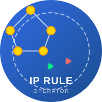

<div align="center">
  
  
  # IP Rule Operator

  [](https://opensource.org/licenses/Apache-2.0)
  [](https://goreportcard.com/report/github.com/mariusbertram/ip-rule-operator)
  [](https://kubernetes.io)
  [](https://www.openshift.com)

  **Automated Management of IP Routing Rules on Kubernetes Nodes**
  
  *Policy-Based Routing for Kubernetes LoadBalancer Services*

</div>

---

A Kubernetes operator for automatic management of IP routing rules on cluster nodes based on Service LoadBalancer IPs.

## 📋 Overview

The **IP Rule Operator** enables Policy-Based Routing in Kubernetes clusters through automatic configuration of Linux IP rules on cluster nodes. The operator monitors LoadBalancer Services and creates IP routing rules based on defined policies that route traffic from Service ClusterIPs through specific routing tables.

### What does the Operator do?

The operator consists of two main components:

1. **Controller (Manager)**: 
   - Monitors Kubernetes LoadBalancer Services
   - Matches LoadBalancer IPs against defined IPRule policies (CIDR-based)
   - Automatically generates IPRuleConfig resources for each Service
   - Manages the Agent DaemonSet
   - Supports IPv4 and IPv6 (Dual-Stack)

2. **Agent (DaemonSet)**:
   - Runs on each node with hostNetwork access
   - Applies/removes IP routing rules on the node
   - Uses Linux netlink for direct kernel interaction
   - Continuously reconciles the desired state
   - Supports IPv4 and IPv6 rules

### What is Policy-Based Routing?

**Policy-Based Routing (PBR)** allows routing decisions to be made not only based on the destination IP address (as in classic routing), but also based on other criteria such as the **source IP address**.

#### Use Case in Kubernetes Context:

In a Kubernetes cluster with multiple network interfaces or load balancers, you may want to:

- **Multi-Homing**: Route traffic from specific services through a specific network interface
- **Provider-based Routing**: Route services from different tenants through different ISP uplinks
- **Traffic Segregation**: Physically separate production and test traffic
- **Geo-Routing**: Regionally distribute traffic based on LoadBalancer IP ranges
- **Dual-Stack Routing**: Handle IPv4 and IPv6 traffic with specific routing tables

#### How does it work?

The operator uses Linux **IP Rules** (see `ip rule`) to route traffic based on the source IP (Service ClusterIP) through alternative routing tables:

```bash
# Example: Traffic from Service 10.96.1.50 uses routing table 100
ip rule add from 10.96.1.50 lookup 100 priority 1000

# Example IPv6: Traffic from Service fd00::1 uses routing table 100
ip -6 rule add from fd00::1 lookup 100 priority 1000
```

Routing table 100 can then contain its own routes, e.g.:
```bash
# Table 100: Traffic via special gateway
ip route add default via 192.168.1.1 dev eth1 table 100
ip -6 route add default via fd00::1 dev eth1 table 100
```

**Result**: All packets originating from the Service IP `10.96.1.50` (or `fd00::1`) are routed through the gateway `192.168.1.1` (or `fd00::1`), while other services use the default route.

## 🏗️ Architecture

### Component Diagram

```
┌─────────────────────────────────────────────────────────────────┐
│                        Kubernetes Cluster                       │
│                                                                 │
│  ┌────────────────────────────────────────────────────────────┐ │
│  │                     Control Plane                          │ │
│  │                                                            │ │
│  │  ┌──────────────────────────────────────────────────────┐  │ │
│  │  │         IP Rule Operator (Controller)                │  │ │
│  │  │                                                      │  │ │
│  │  │  1. Watches Services (LoadBalancer)                  │  │ │
│  │  │  2. Matches LB-IPs against IPRule CRDs               │  │ │
│  │  │  3. Generates IPRuleConfig CRDs                      │  │ │
│  │  │  4. Manages Agent DaemonSet                          │  │ │
│  │  └──────────────────────────────────────────────────────┘  │ │
│  │                            │                               │ │
│  │                            │ watches                       │ │
│  │                            ▼                               │ │
│  │  ┌──────────────────────────────────────────────────────┐  │ │
│  │  │              Custom Resources (CRDs)                 │  │ │
│  │  │                                                      │  │ │
│  │  │  ┌─────────────┐  ┌──────────────┐  ┌────────────┐   │  │ │
│  │  │  │   IPRule    │  │ IPRuleConfig │  │   Agent    │   │  │ │
│  │  │  │ (User-def.) │  │ (Generated)  │  │ (Deploy)   │   │  │ │
│  │  │  │             │  │              │  │            │   │  │ │
│  │  │  │ cidrs: ...  │  │ serviceIP    │  │ image: ... │   │  │ │
│  │  │  │ table: 100  │  │ table: 100   │  │ nodeSelect.│   │  │ │
│  │  │  │ priority    │  │ state: ...   │  │            │   │  │ │
│  │  │  └─────────────┘  └──────────────┘  └────────────┘   │  │ │
│  │  └──────────────────────────────────────────────────────┘  │ │
│  └────────────────────────────────────────────────────────────┘ │
│                                                                 │
│  ┌────────────────────────────────────────────────────────────┐ │
│  │                        Worker Nodes                        │ │
│  │                                                            │ │
│  │  Node 1                Node 2                Node 3        │ │
│  │  ┌──────────┐         ┌──────────┐         ┌──────────┐    │ │
│  │  │  Agent   │         │  Agent   │         │  Agent   │    │ │
│  │  │  Pod     │         │  Pod     │         │  Pod     │    │ │
│  │  │ (DaemonS)│         │ (DaemonS)│         │ (DaemonS)│    │ │
│  │  │          │         │          │         │          │    │ │
│  │  │  Reads   │         │  Reads   │         │  Reads   │    │ │
│  │  │  IPRule  │         │  IPRule  │         │  IPRule  │    │ │
│  │  │  Config  │         │  Config  │         │  Config  │    │ │
│  │  │    ↓     │         │    ↓     │         │    ↓     │    │ │
│  │  │ Applies  │         │ Applies  │         │ Applies  │    │ │
│  │  │ ip rules │         │ ip rules │         │ ip rules │    │ │
│  │  │ via      │         │ via      │         │ via      │    │ │
│  │  │ netlink  │         │ netlink  │         │ netlink  │    │ │
│  │  └────┬─────┘         └────┬─────┘         └────┬─────┘    │ │
│  │       │                    │                    │          │ │
│  │       ▼                    ▼                    ▼          │ │
│  │  ┌─────────────────────────────────────────────────────┐   │ │
│  │  │          Linux Kernel Routing Tables                │   │ │
│  │  │                                                     │   │ │
│  │  │  ip rule show:                                      │   │ │
│  │  │    1000: from 10.96.1.50 lookup 100                 │   │ │
│  │  │    1000: from fd00::1 lookup 100                    │   │ │
│  │  │    ...                                              │   │ │
│  │  └─────────────────────────────────────────────────────┘   │ │
│  └────────────────────────────────────────────────────────────┘ │
└─────────────────────────────────────────────────────────────────┘
```

### Resource Interaction

```
┌──────────────────────────────────────────────────────────────────┐
│                    Workflow & Interactions                       │
└──────────────────────────────────────────────────────────────────┘

  User/Admin                     Kubernetes API
      │                                │
      │ 1. Create IPRule               │
      ├───────────────────────────────>│
      │    (cidrs: [192.168.1.0/24])   │
      │    (table: 100, priority: 1000)│
      │                                │
      │ 2. Create Service (LB)         │
      ├───────────────────────────────>│
      │    (LoadBalancer)              │
      │                                │
                                       │
                      ┌────────────────┴────────────────┐
                      │                                 │
                      ▼                                 │
           IP Rule Controller                           │
                      │                                 │
        3. Watches Services & IPRules                   │
                      │                                 │
        4. Service gets LB IP: 192.168.1.10             │
           ClusterIP: 10.96.1.50                        │
                      │                                 │
        5. Matches: 192.168.1.10 ∈ 192.168.1.0/24       │
                      │                                 │
        6. Creates IPRuleConfig ───────────────────────>│
           - name: iprc-10-96-1-50                      │
           - serviceIP: 10.96.1.50                      │
           - table: 100                                 │
           - priority: 1000                             │
           - state: present                             │
                                                        │
                      ┌─────────────────────────────────┘
                      │
                      ▼
              Agent Controller
                      │
        7. Ensures Agent DaemonSet exists
                      │
                      ├───> Creates/Updates DaemonSet
                      │
                      ▼
            Agent Pods (on each node)
                      │
        8. Reconcile Loop (every 10s):
           - List all IPRuleConfig
           - Read current ip rules (netlink)
                      │
        9. For state=present:
           ├─> Check if rule exists
           └─> If not: ip rule add from 10.96.1.50 
                          lookup 100 priority 1000
                      │
       10. For state=absent:
           ├─> Check if rule exists
           └─> If yes: ip rule del from 10.96.1.50
                          lookup 100 priority 1000
                      │
                      ▼
           ┌──────────────────────┐
           │  Linux Kernel        │
           │  Routing Applied     │
           └──────────────────────┘

────────────────────────────────────────────────────────────────────
  Cleanup Workflow (Service deleted)
────────────────────────────────────────────────────────────────────

    Service Deleted
          │
          ▼
    IP Rule Controller
          │
    11. LoadBalancer IP no longer exists
          │
    12. Updates IPRuleConfig:
        - state: present → absent
          │
          ▼
    Agent Pods
          │
    13. Detects state=absent
          │
    14. Removes ip rule from node
        (ip rule del from 10.96.1.50 ...)
          │
          ▼
    Cleanup Complete
```

## 🚀 Installation

### Prerequisites

- Kubernetes v1.11.3+ or OpenShift 4.x+
- kubectl or oc CLI configured
- Cluster admin privileges for installation
- Linux nodes (Agent requires Linux kernel with netlink support)

### Method 1: Installation via YAML (Kubernetes)

#### Step 1: Install CRDs

```bash
kubectl apply -f https://raw.githubusercontent.com/mariusbertram/ip-rule-operator/main/config/crd/bases/api.operator.brtrm.dev_iprules.yaml
kubectl apply -f https://raw.githubusercontent.com/mariusbertram/ip-rule-operator/main/config/crd/bases/api.operator.brtrm.dev_ipruleconfigs.yaml
kubectl apply -f https://raw.githubusercontent.com/mariusbertram/ip-rule-operator/main/config/crd/bases/api.operator.brtrm.dev_agents.yaml
```

Or with Makefile (from repository):
```bash
make install
```

#### Step 2: Deploy Operator

With pre-built images:
```bash
kubectl apply -f https://raw.githubusercontent.com/mariusbertram/ip-rule-operator/main/dist/install.yaml
```

Or build and deploy yourself:
```bash
export IMG=ghcr.io/mariusbertram/iprule-controller:v0.0.1
export AGENT_IMG=ghcr.io/mariusbertram/iprule-agent:v0.0.1

# Build and push images
make docker-build-all docker-push-all

# Deploy operator
make deploy IMG=${IMG}
```

#### Step 3: Create Agent DaemonSet

**Important**: The Agent resource MUST be named `agent` - this is enforced by CRD validation.

```bash
cat <<EOF | kubectl apply -f -
apiVersion: api.operator.brtrm.dev/v1alpha1
kind: Agent
metadata:
  name: agent  # MUST be named "agent"
  namespace: ip-rule-operator-system
spec:
  # Optional: Specific image
  # image: ghcr.io/mariusbertram/iprule-agent:v0.0.1
  
  # Optional: Node selector
  nodeSelector:
    kubernetes.io/os: linux
  
  # Optional: Tolerations for control plane nodes
  tolerations:
  - key: node-role.kubernetes.io/control-plane
    operator: Exists
    effect: NoSchedule
EOF
```

#### Step 4: Verification

```bash
# Check operator pod
kubectl get pods -n ip-rule-operator-system

# Check agent DaemonSet
kubectl get daemonset -n ip-rule-operator-system iprule-agent

# Check CRDs
kubectl get crds | grep api.operator.brtrm.dev
```

### Method 2: Installation via OLM (OpenShift)

The operator can be installed via the Operator Lifecycle Manager (OLM) in OpenShift.

#### Option A: Via OpenShift Web Console

1. **Open the OpenShift Web Console**
2. Navigate to **Operators** → **OperatorHub**
3. Search for **"IP Rule Operator"**
4. Click on **Install**
5. Select:
   - **Update Channel**: stable
   - **Installation Mode**: All namespaces on the cluster
   - **Installed Namespace**: openshift-operators
   - **Update Approval**: Automatic (recommended)
6. Click on **Install**
7. Wait until the status shows **Succeeded**

#### Option B: Via CLI (oc)

##### Step 1: Create CatalogSource

```bash
cat <<EOF | oc apply -f -
apiVersion: operators.coreos.com/v1alpha1
kind: CatalogSource
metadata:
  name: ip-rule-operator-catalog
  namespace: openshift-marketplace
spec:
  sourceType: grpc
  image: ghcr.io/mariusbertram/ip-rule-operator-catalog:v0.0.1
  displayName: IP Rule Operator Catalog
  publisher: Marius Bertram
  updateStrategy:
    registryPoll:
      interval: 10m
EOF
```

##### Step 2: Create OperatorGroup (if not exists)

```bash
cat <<EOF | oc apply -f -
apiVersion: operators.coreos.com/v1
kind: OperatorGroup
metadata:
  name: global-operators
  namespace: openshift-operators
spec: {}
EOF
```

##### Step 3: Create Subscription

```bash
cat <<EOF | oc apply -f -
apiVersion: operators.coreos.com/v1alpha1
kind: Subscription
metadata:
  name: ip-rule-operator
  namespace: openshift-operators
spec:
  channel: stable
  name: ip-rule-operator
  source: ip-rule-operator-catalog
  sourceNamespace: openshift-marketplace
  installPlanApproval: Automatic
EOF
```

##### Step 4: Verify Installation

```bash
# Check subscription status
oc get subscription ip-rule-operator -n openshift-operators

# Check InstallPlan
oc get installplan -n openshift-operators

# Check ClusterServiceVersion (CSV)
oc get csv -n openshift-operators | grep ip-rule

# Check operator pod
oc get pods -n openshift-operators | grep ip-rule

# Check CRDs
oc get crds | grep api.operator.brtrm.dev
```

##### Step 5: Create Agent Instance

After successful operator installation:

**Important**: The Agent resource MUST be named `agent` - this is enforced by CRD validation.

```bash
cat <<EOF | oc apply -f -
apiVersion: api.operator.brtrm.dev/v1alpha1
kind: Agent
metadata:
  name: agent  # MUST be named "agent"
  namespace: openshift-operators
spec:
  nodeSelector:
    kubernetes.io/os: linux
  tolerations:
  - key: node-role.kubernetes.io/master
    operator: Exists
    effect: NoSchedule
  - key: node-role.kubernetes.io/control-plane
    operator: Exists
    effect: NoSchedule
EOF
```

#### Building and Pushing OLM Bundle Locally

For developers/maintainers:

```bash
# Generate bundle
make bundle VERSION=0.0.1

# Build bundle image
make bundle-build BUNDLE_IMG=ghcr.io/mariusbertram/ip-rule-operator-bundle:v0.0.1

# Push bundle image
make bundle-push BUNDLE_IMG=ghcr.io/mariusbertram/ip-rule-operator-bundle:v0.0.1

# Build catalog image (File-Based Catalog)
make catalog-fbc-build CATALOG_IMG=ghcr.io/mariusbertram/ip-rule-operator-catalog:v0.0.1

# Push catalog image
make catalog-push CATALOG_IMG=ghcr.io/mariusbertram/ip-rule-operator-catalog:v0.0.1
```

### Uninstallation

#### Kubernetes (YAML):

```bash
# Remove operator
make undeploy

# Remove CRDs
make uninstall
```

#### OpenShift (OLM):

```bash
# Via CLI
oc delete subscription ip-rule-operator -n openshift-operators
oc delete csv -n openshift-operators $(oc get csv -n openshift-operators | grep ip-rule | awk '{print $1}')
oc delete catalogsource ip-rule-operator-catalog -n openshift-marketplace

# Or via Web Console:
# Operators → Installed Operators → IP Rule Operator → Uninstall
```

## 📖 Usage

### Example 1: Simple IP Rule

Create an IPRule for LoadBalancer IPs in the range `192.168.1.0/24`:

```yaml
apiVersion: api.operator.brtrm.dev/v1alpha1
kind: IPRule
metadata:
  name: datacenter-a-routing
spec:
  cidrs: 
    - "192.168.1.0/24"
  table: 100
  priority: 1000
```

```bash
kubectl apply -f iprule-example.yaml
```

**Effect**: All services with LoadBalancer IPs in this range will automatically be configured with IP rules using routing table 100.

### Example 2: Multi-Datacenter Setup (Dual-Stack)

```yaml
---
apiVersion: api.operator.brtrm.dev/v1alpha1
kind: IPRule
metadata:
  name: datacenter-a
spec:
  cidrs: 
    - "10.0.0.0/16"
    - "fd00:10::/64"
  table: 100
  priority: 1000
---
apiVersion: api.operator.brtrm.dev/v1alpha1
kind: IPRule
metadata:
  name: datacenter-b
spec:
  cidrs: 
    - "10.1.0.0/16"
    - "fd00:20::/64"
  table: 200
  priority: 1000
---
apiVersion: api.operator.brtrm.dev/v1alpha1
kind: IPRule
metadata:
  name: datacenter-c-priority
spec:
  cidrs: 
    - "10.2.0.0/16"
  table: 300
  priority: 2000
```

**Use Case**: Services with LB IPs from different datacenter ranges use different routing tables (e.g., for different ISP uplinks).

### Example 3: Configure Routing Tables

The IP rules reference routing tables. These must be configured on the nodes:

```bash
# On each node:
# Extend /etc/iproute2/rt_tables
echo "100 datacenter_a" >> /etc/iproute2/rt_tables
echo "200 datacenter_b" >> /etc/iproute2/rt_tables

# Configure routes in table 100
ip route add default via 192.168.1.1 dev eth1 table 100
ip -6 route add default via fd00::1 dev eth1 table 100

# Configure routes in table 200
ip route add default via 192.168.2.1 dev eth2 table 200
ip -6 route add default via fd00::2 dev eth2 table 200

# Ensure persistence with NetworkManager or systemd-networkd
```

### Check Status

```bash
# Display IPRules
kubectl get iprules

# Display IPRuleConfigs (automatically generated)
kubectl get ipruleconfigs

# Check Agent status
kubectl get agent -n ip-rule-operator-system

# Display Agent logs
kubectl logs -n ip-rule-operator-system -l app=iprule-agent --tail=100

# Controller logs
kubectl logs -n ip-rule-operator-system deployment/ip-rule-operator-controller-manager --tail=100

# Check IP rules on a node
kubectl debug node/<node-name> -it --image=nicolaka/netshoot
ip rule show
ip -6 rule show
```

## 🔧 Development

### Local Development

#### Prerequisites
- Go 1.24+
- Docker or Podman
- kubectl
- operator-sdk v1.41.1+
- Access to a Kubernetes cluster (e.g., Kind, Minikube)

#### Setup

```bash
# Clone repository
git clone https://github.com/mariusbertram/ip-rule-operator.git
cd ip-rule-operator

# Install dependencies
go mod download

# Generate code
make generate manifests

# Run tests
make test

# Local build
make build build-agent
```

#### Local Deployment

```bash
# Create Kind cluster
kind create cluster --name ip-rule-operator-dev

# Install CRDs
make install

# Run controller locally (outside the cluster)
make run

# In another terminal: Run agent locally (Linux only)
# WARNING: Requires NET_ADMIN capability
sudo make run-agent
```

#### Build and Push Images

```bash
# Set registry
export REGISTRY=ghcr.io/yourusername/

# Build both images
make docker-build-all VERSION=0.0.2

# Push both images
make docker-push-all VERSION=0.0.2

# Deploy to cluster
make deploy IMG=ghcr.io/yourusername/iprule-controller:v0.0.2
```

### E2E Tests

```bash
# E2E tests with Kind
make test-e2e

# Manual E2E setup
make setup-test-e2e
# Run tests
go test ./test/e2e/ -v -ginkgo.v
# Cleanup
make cleanup-test-e2e
```

### Code Quality

```bash
# Linting
make lint

# Linting with auto-fix
make lint-fix

# Formatting
make fmt

# Vet
make vet
```

## 🤝 Contributing

Contributions are welcome! Please note:

1. **Fork** the repository
2. Create a **feature branch** (`git checkout -b feature/amazing-feature`)
3. **Commit** your changes (`git commit -m 'Add amazing feature'`)
4. **Push** to the branch (`git push origin feature/amazing-feature`)
5. Open a **Pull Request**

### Coding Guidelines

- Follow Go coding standards
- Add tests for new features
- Update documentation
- Run `make lint` and `make test` before committing

## 📝 License

Copyright 2025 Marius Bertram.

Licensed under the Apache License, Version 2.0 (the "License");
you may not use this file except in compliance with the License.
You may obtain a copy of the License at

    http://www.apache.org/licenses/LICENSE-2.0

Unless required by applicable law or agreed to in writing, software
distributed under the License is distributed on an "AS IS" BASIS,
WITHOUT WARRANTIES OR CONDITIONS OF ANY KIND, either express or implied.
See the License for the specific language governing permissions and
limitations under the License.

## 🔗 Links

- [Operator SDK Documentation](https://sdk.operatorframework.io/)
- [Kubebuilder Documentation](https://book.kubebuilder.io/)
- [Linux Policy Routing](https://www.kernel.org/doc/html/latest/networking/policy-routing.html)
- [iproute2 Documentation](https://wiki.linuxfoundation.org/networking/iproute2)

## 📞 Support

For questions or issues:
- Open an [Issue](https://github.com/mariusbertram/ip-rule-operator/issues)
- Contact: Marius Bertram

---

**⭐ If you like this project, give it a star on GitHub!**
