# ip-rule-operator



The ip-rule-operator automates Linux *Policy Routing* rules (`ip rule`) for Kubernetes / OpenShift clusters based on Service LoadBalancer IPs and declarative routing table mappings. It watches:

- `Service` objects (type *LoadBalancer*)
- Custom CRD `IPRule` (CIDR -> routing table / priority mapping)
- Generates internal `IPRuleConfig` resources (desired state per Service IP)
- An *Agent* DaemonSet applies these `IPRuleConfig` entries as real `ip rule` statements (source = Service ClusterIP) on selected nodes and cleans them up when obsolete (marks `absent` -> delete CR & kernel rule).

This yields a fully declarative lifecycle for policy routing tied to Kubernetes services.

---
## Table of Contents
1. [Use Cases](#use-cases)
2. [High-Level Architecture](#high-level-architecture)
3. [Custom Resources](#custom-resources)
4. [Data Flow](#data-flow)
5. [Examples](#examples)
6. [Installation (Kubernetes)](#installation-kubernetes)
7. [OpenShift Notes](#openshift-notes)
8. [Agent Deployment & Control](#agent-deployment--control)
9. [Metrics](#metrics)
10. [Environment Variables](#environment-variables)
11. [Security & Permissions](#security--permissions)
12. [Development & Contribution](#development--contribution)
13. [Troubleshooting](#troubleshooting)
14. [Roadmap / Ideas](#roadmap--ideas)
15. [License](#license)

---
## Use Cases
- Separate egress paths per Service via different routing tables (policy based routing)
- Multi-homing: map external LB IP ranges to specific upstream/VRF tables
- Fine grained egress steering without manual host scripting
- Gradual migration / traffic shifting by changing CRs

---
## High-Level Architecture
```
+----------------+        +------------------+        +--------------------+
|  IPRule (CRD)  |        | Kubernetes       |        | IPRuleConfig (CRD) |
|  cidr->table   |        | Service (LB)     |        | generated (desired) |
+--------+-------+        +---------+--------+        +----------+---------+
         |                           |                           |
         | watch                     | watch                     |
         v                           v                           |
                   +----------------------------------+
                   |     ip-rule-operator Manager     |
                   |  (Controller + Reconciler Logic) |
                   +----------------+-----------------+
                                    |
                                    | list/watch
                                    v
                        +---------------------------+
                        | Agent DaemonSet (per node)|
                        |  reads IPRuleConfig       |
                        |  applies ip rule entries  |
                        +-------------+-------------+
                                      |
                                      v
                              Linux Kernel (Policy Routing)
```

---
## Custom Resources
### IPRule (cluster-scoped)
Declares which Service LoadBalancer ingress IPs (VIPs) within a CIDR are mapped to a routing table/priority. For each matching LB VIP an `IPRuleConfig` is produced; its `serviceIP` is the Service **ClusterIP** (source in the policy rule).

Fields:
- `spec.cidr` (string, e.g. `198.51.100.0/24`) – range of LB VIPs
- `spec.table` (int) – routing table number
- `spec.priority` (int, optional) – `ip rule` priority
- `spec.nodeSelectorLabel` (string) – (Currently NOT evaluated by the controller; present for future direct per-rule node scoping. Today you scope nodes globally via the `Agent` CR `spec.nodeSelector` only.)

### IPRuleConfig (cluster-scoped, generated)
Internal desired state (NOT created by users):
- `spec.serviceIP` – source IP (Service ClusterIP)
- `spec.table` – routing table
- `spec.priority` – priority (0 = let kernel assign; matching logic uses wildcard to prevent duplicate re-add loops)
- `spec.state` – `present` | `absent`

Lifecycle:
1. Controller ensures one `IPRuleConfig` per (ClusterIP, table, priority) that is required -> `state=present`.
2. Removed / outdated tuples are switched to `state=absent` (annotation hash cleared) – no immediate deletion to allow the Agent to observe & remove kernel rule first.
3. Agent sees `absent`, deletes kernel `ip rule` if still present, then deletes the `IPRuleConfig` object (robust retry). This guarantees idempotent cleanup without thrashing.

### Agent (namespaced, singleton)
Controls the agent DaemonSet through a single CR named `default` (enforced by validating webhook).

Fields:
- `spec.image` (optional override for agent image)
- `spec.nodeSelector` – where to run agent pods
- `spec.tolerations` – standard tolerations

Status reports scheduling & readiness plus a hash-triggered rollout state.

---
## Data Flow
1. User applies / updates `IPRule` CRs.
2. Controller watches `Service` (LoadBalancer) objects; for each LB VIP inside a rule's CIDR it generates (ClusterIP, table, priority) tuples.
3. Creates / updates `IPRuleConfig` with `state=present`; missing entries become `absent`.
4. Agent lists `IPRuleConfig` objects, ensures kernel rules: `from <ClusterIP> lookup <table> [priority <p>]`.
5. For `absent` entries agent deletes kernel rule then deletes the CR (preventing repeated rule re-additions thanks to wildcard priority tracking).

---
## Examples
### Service & IPRule
```yaml
apiVersion: v1
kind: Service
metadata:
  name: demo
  namespace: default
spec:
  selector:
    app: demo
  type: LoadBalancer
  ports:
    - port: 80
      targetPort: 8080
---
apiVersion: api.operator.brtrm.dev/v1alpha1
kind: IPRule
metadata:
  name: public-eu
spec:
  cidr: 203.0.113.0/24
  table: 100
  priority: 1000
  nodeSelectorLabel: iprule.operator.brtrm.dev/enabled   # (currently informational only)
```
If the Service gets LB IP `203.0.113.45` and ClusterIP `10.96.23.17` an `IPRuleConfig` is generated and the agent applies:
```
ip rule add from 10.96.23.17 table 100 priority 1000
```

### Agent CR
```yaml
apiVersion: api.operator.brtrm.dev/v1alpha1
kind: Agent
metadata:
  name: default
  namespace: ip-rule-operator
spec:
  image: my-registry/iprule-agent:v1.0.0
  nodeSelector:
    iprule.operator.brtrm.dev/enabled: "true"
  tolerations:
    - operator: Exists
      effect: NoSchedule
```

---
## Installation (Kubernetes)
Prerequisites: Go 1.24+, Docker / Buildx, cluster ≥ 1.28 recommended.

### 1. Build & push images
```bash
export IMG=<your-registry>/ip-rule-operator:latest
export AGENT_IMG=<your-registry>/iprule-agent:latest
make docker-build docker-push IMG=$IMG
make agent-image-build AGENT_IMG=$AGENT_IMG
```
Multi-arch optional:
```bash
docker buildx build --platform linux/amd64,linux/arm64 -t $AGENT_IMG -f Dockerfile.agent --push .
```

### 2. Install CRDs & controller
```bash
make install
# AGENT_IMG wird in deploy via sed eingesetzt
make deploy IMG=$IMG AGENT_IMG=$AGENT_IMG
```

### 3. Create Agent CR
```bash
kubectl create namespace system || true
kubectl apply -f - <<'EOF'
apiVersion: api.operator.brtrm.dev/v1alpha1
kind: Agent
metadata:
  name: default
  namespace: ip-rule-operator
spec:
  nodeSelector:
    iprule.operator.brtrm.dev/enabled: "true"
  tolerations:
    - operator: Exists
      effect: NoSchedule
EOF
```

### 4. Label nodes
```bash
kubectl label node <node1> iprule.operator.brtrm.dev/enabled=true
```

### 5. Apply IPRule & observe Service
```bash
kubectl apply -f examples/iprule-public.yaml
```

### 6. Inspect
```bash
kubectl get ipruleconfigs
kubectl describe agent -n system default
kubectl get ds -n system iprule-agent
```

---
## OpenShift Notes
- Agent benötigt Capability `NET_ADMIN` + `hostNetwork: true` (siehe generierten DaemonSet via `Agent` CR). Ein separates SCC YAML liegt aktuell NICHT unter `config/`; für OpenShift musst du ggf. eine SCC erstellen/zuweisen, z.B.:
```bash
oc create scc iprule-agent-scc \
  --allow-host-network \
  --allow-host-dir-volume-plugin=false \
  --allow-privileged=false \
  --cap-add=NET_ADMIN \
  --read-only-rootfs=false \
  --groups=system:serviceaccounts:system
oc adm policy add-scc-to-user iprule-agent-scc -z ip-rule-operator-iprule-agent -n system
```
- Passen Namespace & ServiceAccount Namen ggf. an.
- RBAC / ClusterRoles werden über Bundle bereitgestellt.

---
## Agent Deployment & Control
Operator manages the DaemonSet via the singleton `Agent` CR. Changing `spec.image`, nodeSelector or tolerations changes a template hash → rolling update (maxUnavailable=1). Status reflects rollout progress.

---
## Metrics
### Controller
- `iprule_config_created_total`
- `iprule_config_updated_total`
- `iprule_config_marked_absent_total`
- `iprule_desired_configs`
- `iprule_absent_configs`

### Agent (`:9090/metrics`)
- `iprule_agent_rules_added_total`
- `iprule_agent_rules_deleted_total`
- `iprule_agent_rule_errors_total`
- `iprule_agent_ipruleconfigs_processed_total`
- `iprule_agent_ipruleconfigs_deleted_total`   (neu; Anzahl gelöschter CRs mit state=absent)
- `iprule_agent_desired_rules`
- `iprule_agent_present_rules`
- `iprule_agent_absent_rules`
- `iprule_agent_reconcile_duration_seconds`

Probes:
- `/health` (liveness)
- `/ready` (readiness, after first successful reconcile)

---
## Environment Variables
Agent Pod supports:
- `RECONCILE_PERIOD` (default `10s`) – Poll Intervall zum Einlesen der `IPRuleConfig` Objekte / Kernel Regeln.
- `METRICS_ADDR` (default `:9090`) – Leerer Wert deaktiviert HTTP Server.

Controller (standard controller-runtime Flags/ENV je nach Manager Start, aktuell keine speziellen eigenen ENV).

---
## Security & Permissions
- Minimal capability: `NET_ADMIN` (no full privileged) – Container läuft als root (`runAsUser: 0`) wegen netlink Rule Management.
- `hostNetwork: true` (policy routing needs host namespace) + `DNSPolicy: ClusterFirstWithHostNet`.
- Cluster-scoped CRDs (IPRule, IPRuleConfig); namespaced Agent CR.
- Validating webhook enforces singleton name `default`.
- Recommended: image signing (cosign), restricted registry access.

---
## Development & Contribution
### Run locally (controller only)
```bash
make generate
make manifests
make run IMG=controller:dev
```
### Tests
```bash
make test
```
### Lint
```bash
make lint
```
PRs welcome – please open an issue first for larger features. Style: go fmt + golangci-lint.

---
## Troubleshooting
| Problem | Cause | Solution |
|---------|-------|----------|
| No `IPRuleConfig` objects | Service lacks LB IP or no CIDR match | Check service: `kubectl get svc -o yaml` |
| ip rule not applied | Agent not running on node | Label node? DaemonSet pods ready? |
| Priority ignored | Kernel default priority used | Provide explicit `priority` > 0 |
| Stale rules remain | Agent noch nicht gelaufen / Config nicht `absent` | Warten bis Agent Loop (RECONCILE_PERIOD), Logs prüfen |
| Rules werden immer wieder neu gesetzt | (Frühere Version) Priority Wildcard fehlte | Update auf aktuelle Version (nutzt Wildcard -1 Schlüssel) |
| `nodeSelectorLabel` hat keine Wirkung | Feld derzeit ungenutzt | Verwende `Agent.spec.nodeSelector` |
| Multiple Agent CRs | Only first (lexicographically smallest) is active | Webhook lehnt Nicht-`default` ab; entferne überschüssige CRs |
| Webhook TLS errors | Missing certs | Integrate cert-manager or accept self-signed for dev |

Logs:
```bash
kubectl logs -n system deploy/ip-rule-operator-manager
kubectl logs -n system ds/iprule-agent
```
Kernel rules check on node:
```bash
ip rule list | grep <ClusterIP>
```

---
## Roadmap / Ideas
- Direct usage of `spec.nodeSelectorLabel` in rule scoping
- Configurable reconcile interval via CR
- Multiple source IP modes (Pod IP sets / Endpoints)
- VRF integration
- Optional hard prune of foreign ip rules
- kind integration tests simulating LB IP assignment

---
## License
Apache License 2.0 – see [LICENSE](LICENSE).

---
Happy routing! 🚀
